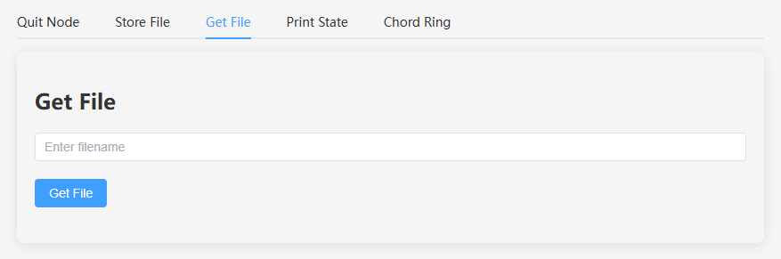

# chord-frontend

Collecting workspace information

## Project Interface

The main interface includes the following tabs:

1. **New Node**: New a node.
2. **Quit Node**: Quit the node.
3. **Store File**: Store a file.
4. **Get File**: Retrieve a file.
5. **Print State**: Print the node state.
6. **Chord Ring**: Display the Chord ring.

### New Node Interface

- File: NewNode.vue
- Functionality: Create a new node.
- Interface Elements:
  - Form to input node configuration, including network, timing, storage, and security settings.
  - Button to create the node.


### Quit Node Interface

- File: QuitNode.vue
- Functionality: Quit the current node.
- Interface Elements: A button to quit the node.


### Store File Interface

- File: StoreFile.vue
- Functionality: Store a file in the node.
- Interface Elements:
  - File upload component to select a file.
  - Button to store the file.
  - Result alert.


### Get File Interface

- File: GetFile.vue
- Functionality: Retrieve a file from the node.
- Interface Elements:
  - Input field to enter the filename.
  - Button to get the file.
  - Result alert.



### Print State Interface

- File: PrintState.vue
- Functionality: Display the current state of the node.
- Interface Elements:
  - Refresh button to update the node state.
  - Node information including identifier, address, port, etc.
  - Predecessor information.
  - Successor information.
  - Local storage information.
  - Successor and backup storage information.
  - Finger table information.


### Chord Ring Interface

- File: ChordRing.vue
- Functionality: Display a visual representation of the Chord ring.
- Interface Elements:
  - Refresh button to update the node state.
  - Error alert.
  - SVG chart to display the Chord ring.


### Components

- FingerInfo Component
  - File: FingerInfo.vue
  - Functionality: Display information about a finger in the finger table.
- NodeInfo Component
  - File: NodeInfo.vue
  - Functionality: Display node information.
- StorageList Component
  - File: StorageList.vue
  - Functionality: Display a list of stored items.
- SuccessorBackup Component
  - File: SuccessorBackup.vue
  - Functionality: Display successor and backup storage information.

## Compile

### Recommended IDE Setup

[VSCode](https://code.visualstudio.com/) + [Volar](https://marketplace.visualstudio.com/items?itemName=Vue.volar) (and disable Vetur).

### Customize configuration

See [Vite Configuration Reference](https://vite.dev/config/).

### Project Setup

```sh
npm install
```

#### Compile and Hot-Reload for Development

```sh
npm run dev
```

#### Compile and Minify for Production

```sh
npm run build
```

#### Start a Build Dist

```sh
npm install -g serve

serve -s dist
```
